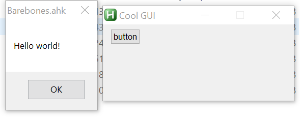

# CGUI

## Contributors

* [ChrisS85](https://github.com/ChrisS85)
* [Oliver Lipkau](https://github.com/lipkau)
* [Sancarn](https://github.com/sancarn)

## Description

This is an object-oriented GUI library for autohotkey (AHK).

The library comes fresh with a suite of controls for use within your own GUIs:

* CTextControl
* CEditControl
* CButtonControl
* CCheckboxControl
* CChoiceControl
* CListViewControl
* CLinkControl
* CGroupBoxControl
* CStatusBarControl
* CTreeViewControl
* CTabControl
* CProgressControl
* CSliderControl
* CHotkeyControl
* CActiveXControl
* CPictureControl

_CGUI was originally developed by ChrisS85 and can be found [here](https://github.com/ChrisS85/CGUI). Unfortunately this was library was discontinued. This fork is an attempt to continue collaborated development on this._

## Basic example

### Source

```ahk
#SingleInstance,Force
#include ..\CGUI.ahk

;Create GUI with title "Cool GUI"
new MyGui("Cool GUI")
return

;Extend CGUI to build a new GUI
Class MyGui Extends CGUI {
  ;Controls can be defined as class variables at the top of the class like this:
  ;Note: 2nd parameter is used in method callbacks. Alternatively callbacks can be assigned directly. (To do example)
  btnButton := this.AddControl("Button", "myButton", "", "button")
  
  __New(Title){
    ;Set title
    this.Title := Title

    ;Some options we probably want
    this.CloseOnEscape := true
    this.DestroyOnClose := true
    
    ;Show the window
    this.Show("w250 h100")
  }
  
  ;On click of myButton
  myButton_click(){
      msgbox Hello world!
  }
}
```

### Result



## Other Examples

Detailed examples can be found in the [samples](https://github.com/lipkau/CGUI/tree/master/samples) directory.